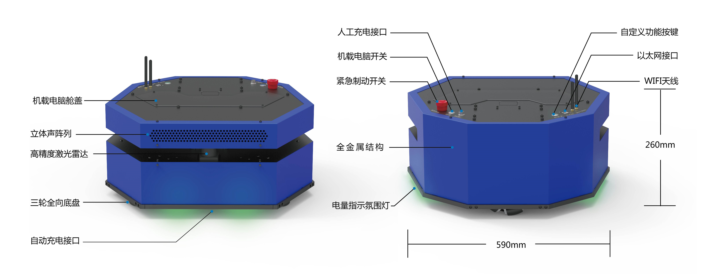
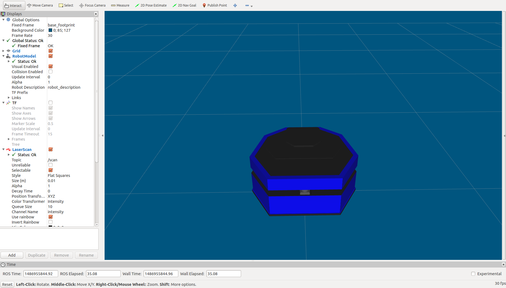
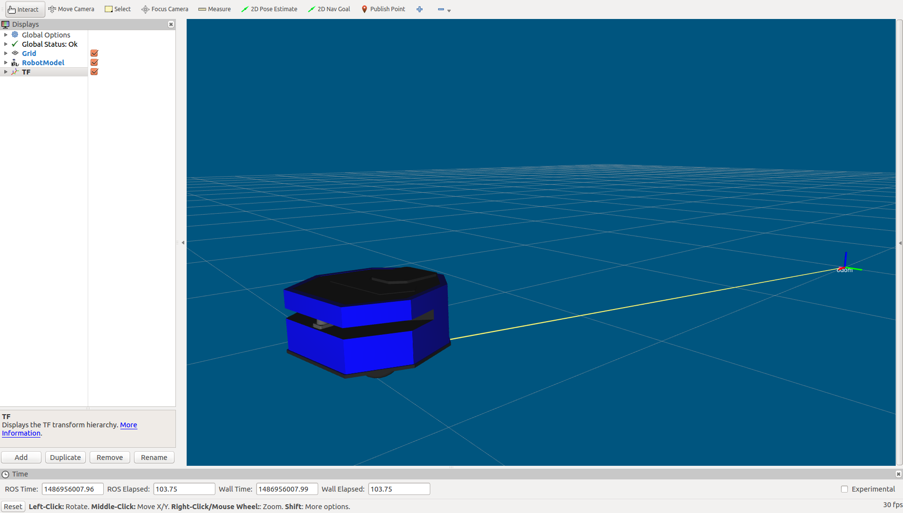
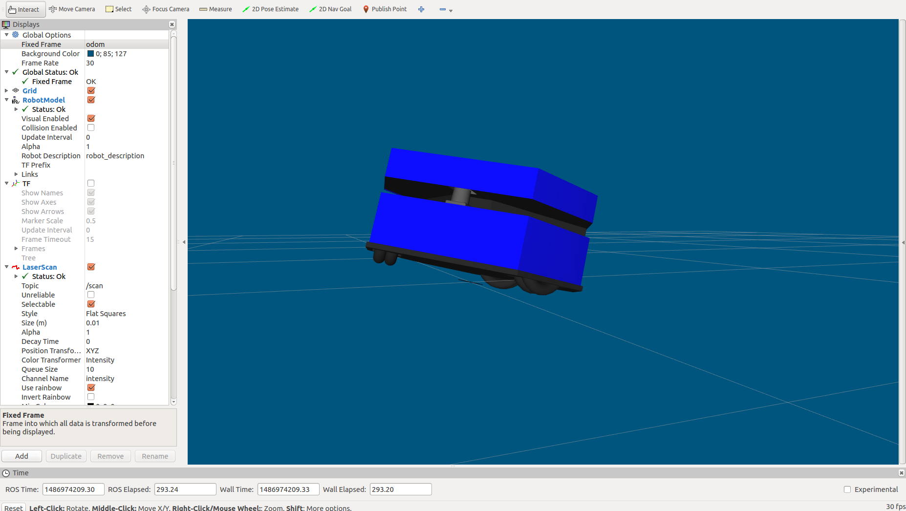
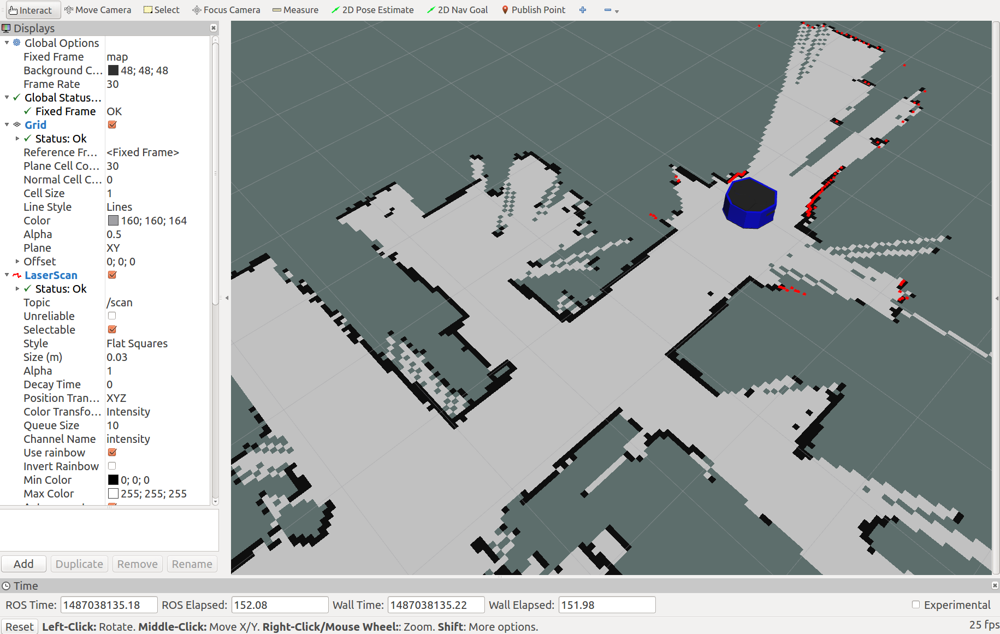
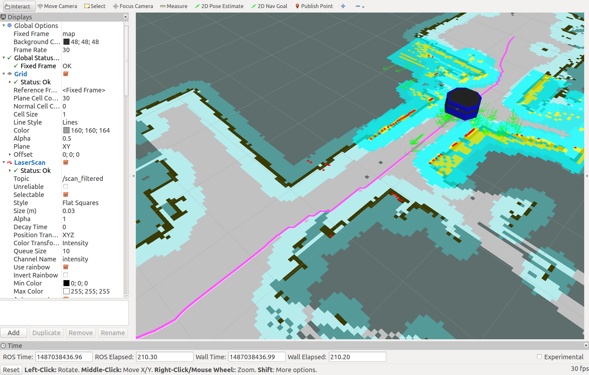
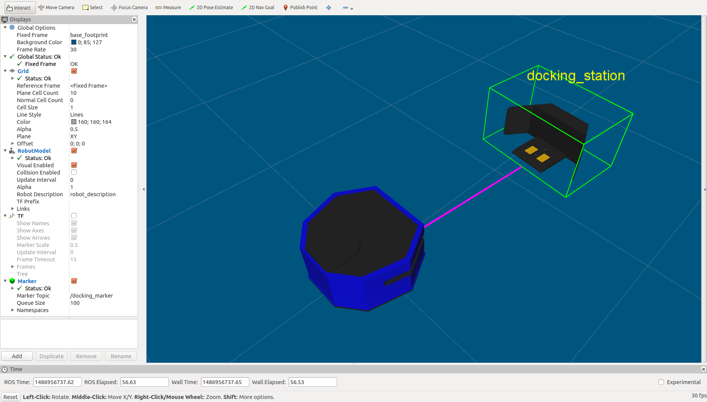

# 启程3机器人开放源码

## 使用步骤

1. 安装ROS(kinetic/Ubuntu 16.04). [安装步骤](http://wiki.ros.org/kinetic/Installation/Ubuntu?_blank)
2. 配置好开发环境. [配置方法](http://wiki.ros.org/ROS/Tutorials/InstallingandConfiguringROSEnvironment)
3. 安装依赖项:
```
sudo apt-get install ros-kinetic-joy
sudo apt-get install ros-kinetic-hector-mapping
sudo apt-get install ros-kinetic-gmapping 
sudo apt-get install ros-kinetic-map-server
sudo apt-get install ros-kinetic-navigation
sudo apt-get install ros-kinetic-move-base
sudo apt-get install ros-kinetic-amcl
sudo apt-get install ros-kinetic-audio-common
sudo apt-get install libasound2
sudo apt-get install ros-kinetic-sound-play
```
4. 获取源码:
```
cd ~/catkin_ws/src/
git clone https://github.com/6-robot/wpv3.git
```
5. 设置设备权限
```
roscd wpv3_bringup
cd scripts
chmod +x create_udev_rules.sh
./create_udev_rules.sh 
```
6. 编译
```
cd ~/catkin_ws
catkin_make
```
7. 欢迎享用 :)

## 平台介绍
启程3是[北京六部工坊科技有限公司](http://www.6-robot.com)推出的一款面向室内定位导航应用的移动机器人产品。该产品底盘采用三轮全向方案，具备360°全方向移动能力。默认标配一枚高精度进口激光雷达，具备室内SLAM环境建图功能，结合ROS-Navigation导航系统，可以在室内完成自主导航功能。机身内部标配一台Intel CPU高性能计算机，具备USB、Ethernet等多种数据接口，为机器人的功能扩展提供了极大的空间。
启程3为各类室内机器人应用提供一个稳定可靠的底盘基础，可以在平台上扩展额外的任务载荷。使用户的主要精力从繁琐的底盘设计制造工作中解放出来，专注于业务本身的功能实现，从而大大加速整个应用的开发进度，尽早为用户带来效益。


## 功能特性

### 1. URDF模型描述
启程3运行ROS操作系统，具备完整的URDF模型描述，可以在ROS系统里直接加载和扩展。


### 2. 电机码盘里程计
启程3装备了带编码器的直流伺服电机，可以在ROS里接收电机码盘计数，从而推算出机器人的移动里程信息。


### 3. IMU姿态传感
启程3内置了一枚六轴的IMU单元，可以实时获取机器人的滚转、倾斜和朝向信息，为机器人的上层控制算法提供数值依据。


### 4. SLAM环境建图
启程3装备了一枚国外进口的高精度激光雷达，可以实时扫描机器人周围的障碍物分布状况，借助HectorSLAM和GMapping算法，创建环境地图。


### 5. 自主定位导航
启程3将激光雷达扫描的距离信息与电机里程计数据进行融合，使用AMCL方法进行地图定位，结合ROS里的move_base进行自主导航。


### 6. 自主充电
启程3可以在周围搜索其专属的充电装置，自主引导进入充电坞进行充电。



